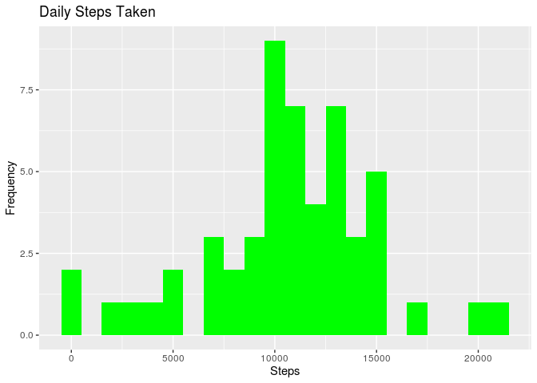

Load packages and set work directory
------------------------------------

    ## load packages
    library(data.table)
    library(ggplot2)
    # Fork github url before setting wd
    # set work directory
    setwd("~/Soft/Rtest/RepData_PeerAssessment1")

Loading and preprocessing the data
----------------------------------

Download the source code file

    ## Download the source code file
    fileUrl <- "https://d396qusza40orc.cloudfront.net/repdata%2Fdata%2Factivity.zip"
    download.file(fileUrl, destfile = "./data/repdata_data_activity.zip")

unzip the file in linux, then

    activity <- data.table::fread('./data/activity.csv')

What is mean total number of steps taken per day?
-------------------------------------------------

Calculate the total number of steps per day

    #activity[, lapply(.SD, sum, na.rm = FALSE)]
    total_steps <- activity[, c(lapply(.SD, sum, na.rm = FALSE))
             , .SDcols = c("steps")
             , by = .(date)         
            ]
    head(total_steps)

    ##          date steps
    ## 1: 2012-10-01    NA
    ## 2: 2012-10-02   126
    ## 3: 2012-10-03 11352
    ## 4: 2012-10-04 12116
    ## 5: 2012-10-05 13294
    ## 6: 2012-10-06 15420

Make a histogram of the total number of steps taken each day.

    g <- NULL
    g <- ggplot(total_steps, aes(x = steps))
    g <- g + geom_histogram(fill = 'green', binwidth = 1000)
    g <- g + labs(
        title = "Daily Steps Taken"
        , x = 'Steps'
        , y = "Frequency"
    )
    g

    ## Warning: Removed 8 rows containing non-finite values (stat_bin).

Report mean and median values of the total number of steps taken per day

    total_steps[, .(Mean_steps = mean(steps, na.rm = TRUE)
                   , Median_steps = median(steps, na.rm = TRUE)
                   )
               ]

    ##    Mean_steps Median_steps
    ## 1:   10766.19        10765

What is the average daily activity pattern?
-------------------------------------------

Make a dataframe named *interval*, showing average number of steps taken
everyday

    interval <- activity[
        , c(
            lapply(.SD, mean, na.rm = TRUE)
           )
        , .SDcols = c("steps")
        , by = .(interval)
    ]
    head(interval)

    ##    interval     steps
    ## 1:        0 1.7169811
    ## 2:        5 0.3396226
    ## 3:       10 0.1320755
    ## 4:       15 0.1509434
    ## 5:       20 0.0754717
    ## 6:       25 2.0943396

Plot the average steps (y-axis) and days (x-axis)

    g <- ggplot(interval, aes(x = interval, y = steps))
    g <- g + geom_line(color = 'red', size = 1)
    g <- g + labs(
        title = "Average Daily Steps"
        , xlab = 'Interval'
        , ylab = "Average Steps Per Day"
    )
    g

Which 5-minute interval, on average across all the days in the dataset,
contains the maximum number of steps?

    interval[steps == max(steps), .(max_interval = interval)]

    ##    max_interval
    ## 1:          835

Imputing missing values
-----------------------

Check number of NAs in the column steps

    #activity[is.na(steps), .N]
    nrow(activity[is.na(steps), ])

    ## [1] 2304

Replace NAs with median values

    #activity[is.na(steps), "steps"] <- 
    activity[is.na(steps), 'steps'] <- activity[, c(lapply(.SD, median, na.rm=TRUE))
                                                 , .SDcols = c("steps")
                                                ]

Export a tidy dataset with missing value filled

    data.table::fwrite(x = activity, file = './data/tidyData.txt', quote = FALSE)

Total number of steps taken per day

    # total number of steps taken per day
    total_steps <- activity[, c(lapply(.SD, sum)), .SDcols = c("steps"), by = .(date)]
    head(total_steps)

    ##          date steps
    ## 1: 2012-10-01     0
    ## 2: 2012-10-02   126
    ## 3: 2012-10-03 11352
    ## 4: 2012-10-04 12116
    ## 5: 2012-10-05 13294
    ## 6: 2012-10-06 15420

Mean and median total number of steps taken per day

    # mean and median total number of steps taken per day
    total_steps[, .(mean_steps = mean(steps), median_steps = median(steps))]

    ##    mean_steps median_steps
    ## 1:    9354.23        10395

Make the plot

    g <- NULL
    g <- ggplot(total_steps, aes(x = steps))
    g <- g + geom_histogram(fill = "darkblue", binwidth = 1000)
    g <- g + labs(
        title = "daily Steps Taken"
        , x = "Steps"
        , y = "Frequency"
    )
    g

Are there differences in activity patterns between weekdays and weekends?
-------------------------------------------------------------------------

Create a new factor column with 2 levels: weekday and weekend

    # create a new factor column with 2 levels: weekday and weekend
    activity <- fread(input = './data/activity.csv')
    activity[, date := as.POSIXct(date, format = "%Y-%m-%d")]
    activity$"Day_of_Week" = weekdays(activity$date)

Create a new column, indicating whether the day is weekday (Monday to
Friday) or weekend (Saturday, Sunday)

    activity [grepl(pattern = "星期一|星期二|星期三|星期四|星期五", x = activity$'Day_of_Week'), "Weekday_or_Weekend"] <- "Weekday"
    activity [grepl(pattern = "星期六|星期日", x = activity$'Day_of_Week'), "Weekday_or_Weekend"] <- "Weekend"

Check the dataframe

    str(activity)

    ## Classes 'data.table' and 'data.frame':   17568 obs. of  5 variables:
    ##  $ steps             : int  NA NA NA NA NA NA NA NA NA NA ...
    ##  $ date              : POSIXct, format: "2012-10-01" "2012-10-01" ...
    ##  $ interval          : int  0 5 10 15 20 25 30 35 40 45 ...
    ##  $ Day_of_Week       : chr  "星期一" "星期一" "星期一" "星期一" ...
    ##  $ Weekday_or_Weekend: chr  "Weekday" "Weekday" "Weekday" "Weekday" ...
    ##  - attr(*, ".internal.selfref")=<externalptr>

Replace missing values in "steps" column by median value

    # Replace missing values in "steps" column by median value
    activity[is.na(steps), 'steps'] <- median(activity$steps, na.rm = TRUE)

Create a new dataframe, replace missing values in "steps" column by mean
value, by interval and "Weekday or Weekend"

    # Create a new dataframe, replace missing values in "steps" column by mean value, by interval and "Weekday or Weekend"
    interval_df <- activity[, c(lapply(.SD, mean, na.rm = TRUE)), .SDcols = c("steps"), by = .(interval, `Weekday_or_Weekend`)]
    #interval_df$"Weekday_or_Weekend" <- as.factor(interval_df$"Weekday_or_Weekend")
    interval_df$Weekday_or_Weekend <- as.factor(interval_df$Weekday_or_Weekend)

    str(interval_df)

    ## Classes 'data.table' and 'data.frame':   576 obs. of  3 variables:
    ##  $ interval          : int  0 5 10 15 20 25 30 35 40 45 ...
    ##  $ Weekday_or_Weekend: Factor w/ 2 levels "Weekday","Weekend": 1 1 1 1 1 1 1 1 1 1 ...
    ##  $ steps             : num  2.0222 0.4 0.1556 0.1778 0.0889 ...
    ##  - attr(*, ".internal.selfref")=<externalptr>

Make a panel plot containing a time series plot (i.e. 𝚝𝚢𝚙𝚎 = "𝚕") of the
5-minute interval (x-axis) and the average number of steps taken,
averaged across all weekday days or weekend days (y-axis). See the
README file in the GitHub repository to see an example of what this plot
should look like using simulated data.

    g <- NULL
    g <- ggplot(interval_df, aes(x = interval, y = steps, color = Weekday_or_Weekend))
    g <- g + geom_line()
    g <- g + facet_wrap(~Weekday_or_Weekend, nrow = 1, ncol=2)
    g

